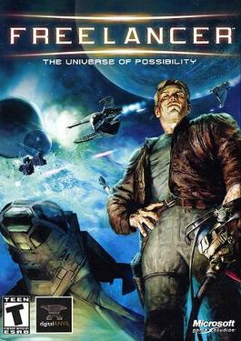

# Freelancer.Reverse.Runtime

### Я строю **runtime-слой поверх Freelancer (2003)**

  <strong>🌐 Язык: </strong>
  
  
    ✅ 🇷🇺 Русский (текущий)
  
  | 
  <a href="./README.md" style="color: #0891b2; margin: 0 10px;">
    🇺🇸 English
  </a>

---

> [!CAUTION]
> Этот проект — не просто реверс отдельных функций.  
> Я постепенно строю **собственный управляемый runtime-слой поверх оригинального движка Freelancer**.

---

<h1> О проекте 🎇 </h1>
</img>
   

`Freelancer (2003)` — `американская` видеоигра в жанре `космического` `торгового` и `боевого` `симулятора`, разработанная `Digital Anvil` и изданная Microsoft Game Studios `4 марта 2003 г`.

> [!CAUTION]
> Моя модификация игры `Freelancer (2003)` - [Lizerium](https://lizup.ru) | [Lizerium - исходники](https://github.com/Lizerium)

Цель этого проекта — не просто анализировать оригинальные бинарники, а **постепенно восстанавливать, документировать и безопасно расширять поведение игры и сервера через совместимые proxy DLL, runtime-компоненты и reverse engineering**.

Вместо хаотичного патчинга памяти я иду по более управляемому пути:  
я создаю **совместимые системные модули**, которые можно:

- подключать вместо оригинальных DLL
- использовать как точку анализа поведения движка
- расширять собственной логикой
- постепенно превращать в понятный и контролируемый слой кода на C++

> [!IMPORTANT]
> За 20+ лет было создано множество плагинов-библиотек который внедряли новый функционал в игру, но они манипулировали памятью Freelancer (2003), я же хочу действовать не манипуляциями памяти, а универсально через свой исходный код, так как это надёжно и контролируемо.

---

## Идея проекта

Моя идея — **не ломать оригинальный движок**, а **строить вокруг него собственный инженерный слой**, который позволяет:

- понимать, как реально работает Freelancer изнутри
- восстанавливать системные контракты DLL
- безопасно внедрять новый функционал
- документировать архитектуру старого движка
- постепенно переводить “чёрный ящик” бинарников в **контролируемую C++-систему**

По сути, это путь к **частичной реконструкции runtime-архитектуры Freelancer**.

> [!NOTE]
> Я не пытаюсь “переписать игру с нуля”.  
> Я строю **совместимый слой поведения**, который можно безопасно внедрять поверх оригинальных бинарников.

---

## Что уже реализовано

На текущий момент проект уже перешёл из стадии “идеи” в **рабочее состояние**.

### Уже сделано

#### `dacom.dll`

- [x] создан рабочий proxy-модуль [`dacom.dll`](libs/game/dacom)
  - [x] реализована загрузка оригинальной DLL через `dacom_addon.dll`
  - [x] восстановлены и проксируются основные экспорты
  - [x] добавлено логирование параметров вызовов
  - [x] подтверждено, что DLL реально участвует в:
    - [x] CRC / string hashing
    - [x] сравнении строк
    - [x] внутреннем telemetry / logging слое
    - [x] системной инициализации

##### 👍 Проверено

- модуль успешно загружается игрой
- экспортные функции вызываются корректно
- прокси-реализация не ломает запуск
- логирование подтверждает реальное участие `dacom.dll` в runtime-пайплайне клиента
- новый модуль не совместим с плагинами которые манипулировали старой версией `dacom.dll`

> [!IMPORTANT]
> `dacom.dll` уже не является просто “догадкой из реверса”.  
> Это **подтверждённый рабочий runtime-компонент**, протестированный в реальном окружении игры.

---

## Подход проекта

> [!TIP]
> Ключевая идея проекта:
>
> **Снаружи — полная совместимость.  
> Внутри — мой собственный управляемый код.**

---

## Текущее направление

Сейчас проект движется в сторону:

- восстановления других системных DLL
- построения общей runtime-инфраструктуры
- создания повторно используемых proxy-компонентов
- формирования собственной reverse-документации по Freelancer

> [!WARNING]
> Это исследовательский и инженерный проект.  
> Некоторые части архитектуры всё ещё находятся в стадии анализа и подтверждения через runtime-трассировку.

---

## Текущие компоненты

### Reverse / Proxy Modules

- [`dacom`](libs/game/dacom) — рабочий proxy-модуль системной DLL, участвующей в CRC, string utilities и telemetry

### Exist dll Hooks

- [`custom`](libs/custom) - папка в которой будет находиться мой набор хуков к модификации фрилансер который писал либо я либо другие авторы и было пересобрано мной, это необходимо для того чтобы встраивать в будущем функционал в `Reverse / Proxy Modules`

---

## Идейная цель

Моя долгосрочная цель — превратить закрытый runtime Freelancer в **документированную, исследуемую и частично управляемую C++-систему**, с которой можно работать уже не как с “чёрным ящиком”, а как с инженерной архитектурой.

---

## Примечание

Этот проект ведётся в исследовательских целях и не распространяет оригинальные игровые ресурсы или бинарные файлы Freelancer.
